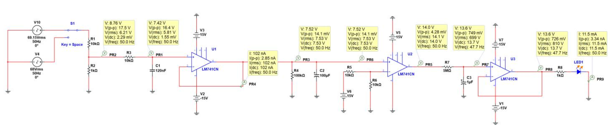
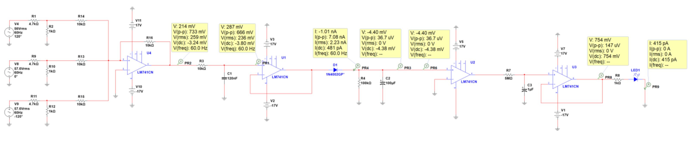

# Overvoltage & Unbalance Detection Circuit

Circuit course project (Semester 3).
This project designs a protection circuit to detect overvoltage and voltage imbalance in power systems.

## ✅ Single-phase Overvoltage Detection
- Voltage divider for safe scaling
- Low-pass filter to eliminate switching noise
- Half-wave rectifier + comparator threshold detection
- LED alarm with RC delay

## ✅ Three-phase Voltage Unbalance Detection
- Phase voltage scaling
- Summing amplifier for imbalance monitoring
- Worst-case phase-loss analysis

## Tools
- NI Multisim
- LM741 Operational Amplifier

## Circuit Diagram (Single-phase Overvoltage)

## Circuit Diagram (Three-phase Unbalance)

## Files
- `Report/`: Full project documentation (PDF, Persian)
- `Multisim-Files/`: NI Multisim simulation files (.ms14)
- `Images/`: Circuit diagrams used in this README
- `Project-Statement/`: Project requirements and statement document

## Contributors
This was a group project developed for the Circuit Course.

- Mohammadreza Abbasgholi Doolabi
- Ali Rezaee ([@sarazaee](https://github.com/sarazaee))
